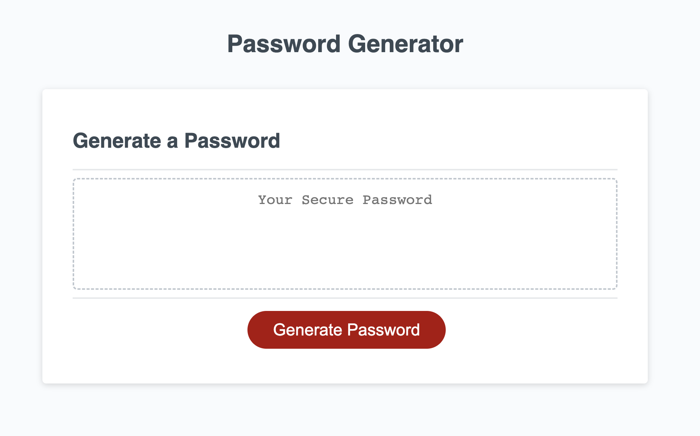
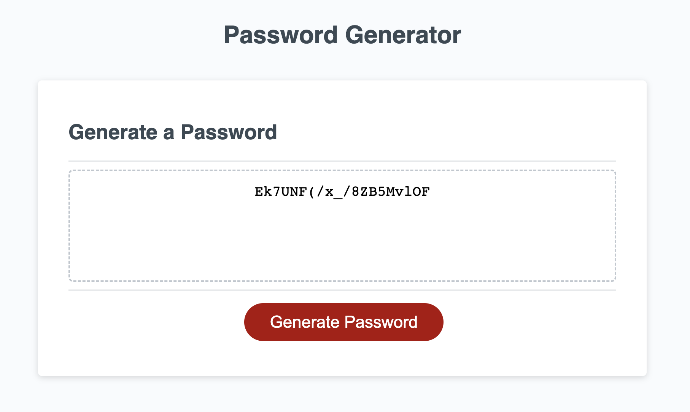

# Password-Generator
I created a password generator using JavaScript.

## Description
This application is for generating random passwords. 

The application offers you five options. You can choose your password length and character types (lowercase, uppercase, numeric and special characters). After making selections, the application automatically generates a random password for you.

### Before Generating the Password

### After Generating the Password
